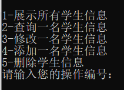

# cppProgramingOOP
面向对象程序设计C++实现

## 文件介绍

- ```studnet.h``` & ```student.cpp```

学生类实现，项目的实体类，具体定义如下：

```c++
class student
{
public:
	int id;
	string name;
	string info;

	void introduce();

	student();
	student(int id,string na,string info);
	~student();
};

```

- ```class.h``` & ```class.cpp```

班级类实现，定义如下

```c++
class Class
{
public:
	student students[50];

	int n;

	void showAllstudents();

	student querystudent(int id);

	bool changeOnestudent(student s);

	int  addOnestudent(student s);
	
	bool  deleteOnestudent(int id);
	
	Class();

	~Class();

};

```

```ClassStudentProject.h``` & ```ClassStudentProject.cpp```

工程入口。

## 效果截图
### 菜单
